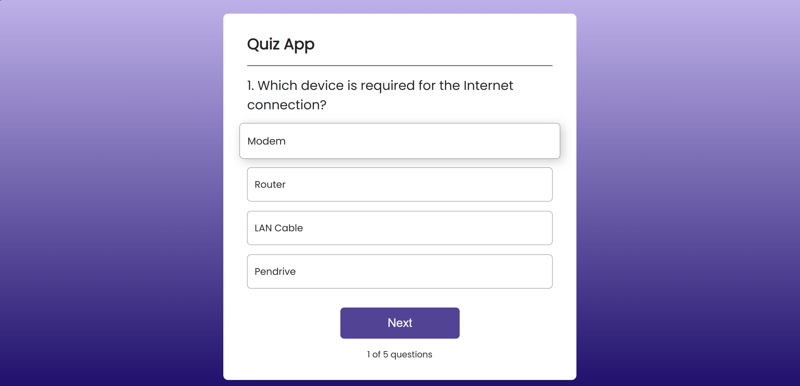
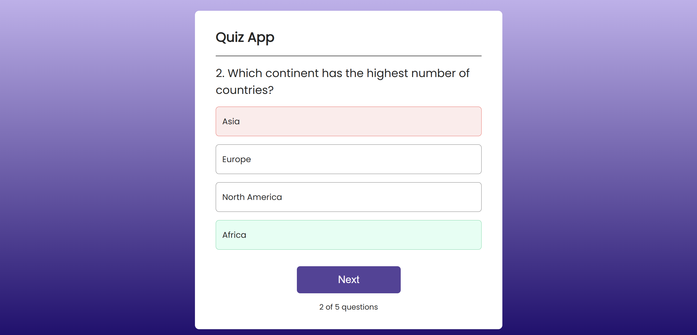
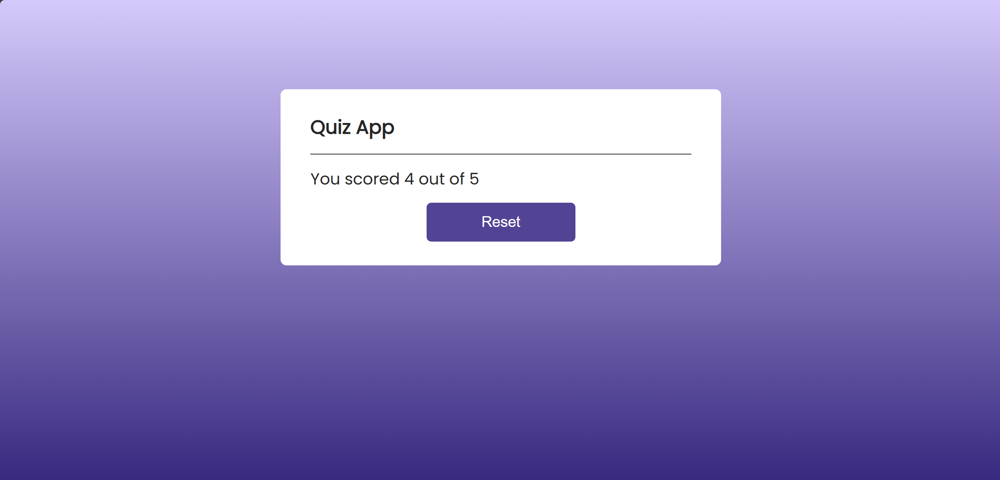

<div id="top"></div>

[](#)
[](#)
[](#)
[](#)


<div align="center">
  <h1 align="center">Quiz App</h1>
  <p>
    This is a simple Quiz App built with React.</br>The application allows users to answer multiple-choice questions, see their score, and reset the quiz.
  </p>
</div>



# Features

- Interactive multiple-choice quiz
- Tracks and displays the user’s score
- Highlights correct and incorrect answers
- Responsive design
- Reset option to restart the quiz

 

## Technologies Used

- **React:** For building the UI components.
- **CSS:** For styling the application.



### Getting Started

1. **Clone the repository**:
    ```bash
    git clone https://github.com/V3n0nX/quiz-app.git
    cd your-repo
    ```

2. **Install the required dependencies**:
    ```bash
    npm install
    ```

4. **Run the development server**:
    ```bash
    npm run dev
    ```

5. Open your browser and visit `[http://localhost:5173/]` to see the page in action!

